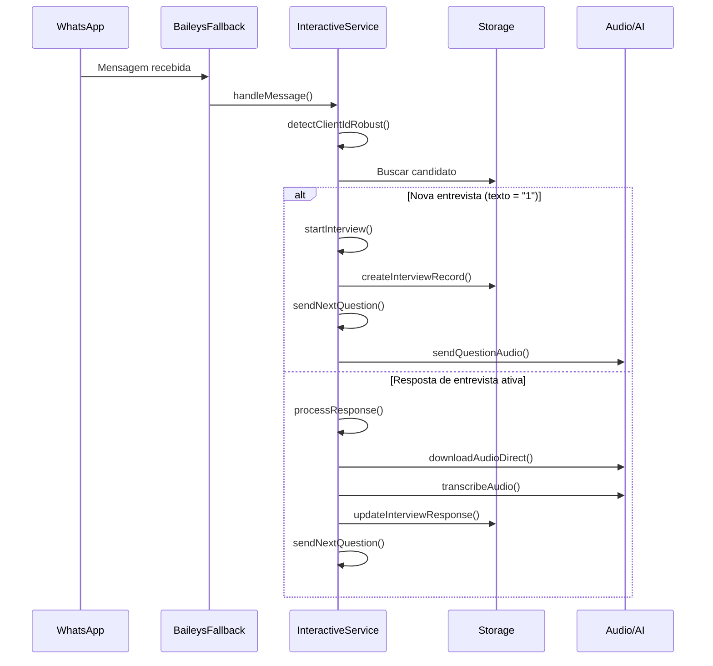
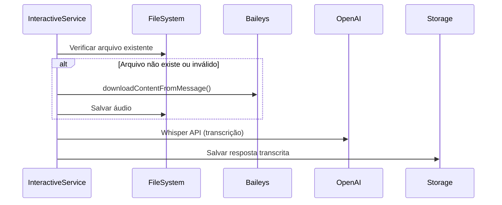

# Documentação do interactiveInterviewService.ts

## Visão Geral

O `interactiveInterviewService.ts` é um serviço central do sistema responsável por gerenciar entrevistas interativas via WhatsApp. Ele orquestra todo o fluxo de comunicação entre candidatos e o sistema de IA, incluindo processamento de áudio, transcrição, e gerenciamento de estado das entrevistas ativas.

## Localização do Arquivo

**`server/interactiveInterviewService.ts`** (979 linhas)

## 📁 Estrutura de Dependências

### 🎯 **Importações Diretas (Top-level)**

#### **Serviços Core**
- **`./storage`** - Camada de persistência principal
  - **Função**: Acesso ao banco de dados e operações CRUD
  - **Métodos utilizados**: 
    - `getCandidatesByMultipleClients()`
    - `getCandidatesByClientId()`
    - `createInterviewRecord()`
    - `updateInterviewResponse()`

#### **Serviços WhatsApp**
- **`../whatsapp/services/userIsolatedRoundRobin`**
  - **Função**: Sistema de isolamento de usuários e cadência
  - **Métodos utilizados**:
    - `validateUserIsolation()`
    - `processUserCadence()`

### 🔄 **Importações Dinâmicas (await import)**

#### **Serviços WhatsApp Principais**
- **`../whatsapp/services/simpleMultiBailey`** (6x referências)
  - **Função**: Gerenciamento de múltiplas conexões Baileys
  - **Métodos utilizados**:
    - `getConnectionStatus()`
    - `sendTestMessage()`
    - `sendMessage()`
    - Acesso direto às conexões via `connections.get()`

#### **Biblioteca WhatsApp (Baileys)**
- **`@whiskeysockets/baileys`** (2x referências)
  - **Função**: Biblioteca principal para integração WhatsApp
  - **Métodos utilizados**:
    - `downloadContentFromMessage()`
    - `downloadMediaMessage()`

#### **Serviços de IA e Processamento**
- **`./candidateEvaluationService`**
  - **Função**: Avaliação automatizada de candidatos
  - **Métodos utilizados**: Análise de respostas de entrevista

- **`openai`**
  - **Função**: Integração com OpenAI para transcrição
  - **Uso**: Transcrição de áudio via Whisper API

#### **Sistema de Arquivos e Configuração**
- **`../src/config/paths`**
  - **Função**: Configuração de diretórios do sistema
  - **Constantes utilizadas**: `UPLOADS_DIR`

- **`fs`** (3x referências)
  - **Função**: Operações de sistema de arquivos
  - **Operações**: Leitura, escrita e verificação de arquivos de áudio

- **`path`** (3x referências)
  - **Função**: Manipulação de caminhos de arquivos
  - **Uso**: Construção de paths para arquivos de áudio

- **`./storage.js`** (importação secundária)
  - **Função**: Backup/alternativa para operações de storage

## 🔧 **Arquivos de Configuração Relacionados**

### **Configuração de Paths**
- **`src/config/paths.ts`** (11 linhas)
  - **Função**: Define diretório de uploads
  - **Configuração**: `UPLOADS_DIR` para armazenamento de áudios
  - **Auto-criação**: Cria pasta automaticamente se não existir

### **Serviços WhatsApp Dependencies**

#### **Pasta: `whatsapp/services/`**
- **`userIsolatedRoundRobin.ts`** (406 linhas)
  - Sistema de isolamento de usuários
  - Gestão de cadência de mensagens

- **`simpleMultiBailey.ts`** (859 linhas)
  - Gerenciamento de múltiplas instâncias Baileys
  - Pool de conexões WhatsApp
  - Status de conexões por slot

#### **Outros Serviços WhatsApp Relacionados**
- **`activeSessionDetector.ts`** (239 linhas)
- **`connectionDetector.ts`** (214 linhas)
- **`whatsappManager.ts`** (332 linhas)
- **`baileys-config.ts`** (192 linhas)

## 🏗️ **Arquitetura e Fluxo Principal**

### **Classe: `InteractiveInterviewService`**

#### **Estado em Memória**
```typescript
interface ActiveInterview {
  candidateId: number;
  candidateName: string;
  phone: string;
  jobId: number;
  jobName: string;
  clientId: string;
  currentQuestion: number;
  questions: any[];
  responses: Array<{
    questionId: number;
    questionText: string;
    responseText?: string;
    audioFile?: string;
    timestamp: string;
  }>;
  startTime: string;
  selectionId: string;
  interviewDbId?: string;
}
```

#### **Gerenciamento de Estado**
- **`activeInterviews: Map<string, ActiveInterview>`**
  - Armazena entrevistas em andamento
  - Chave: número de telefone
  - Valor: objeto completo da entrevista

### **Métodos Principais**

#### **🔍 Detecção e Validação**
1. **`detectClientIdRobust(phone, clientId?)`**
   - **Função**: Detecta clientId baseado no telefone
   - **Lógica**: Busca candidatos por múltiplos clientes
   - **Fallback**: Critério determinístico (mais recente)

2. **`validateClientForCadence(clientId, phone)`**
   - **Validações**: 
     - Conexões WhatsApp ativas
     - Existência do candidato na base
     - Correspondência exata de telefone

#### **🎤 Processamento de Mensagens**
3. **`handleMessage(from, text, audioMessage?, clientId?)`**
   - **Ponto de entrada principal** para mensagens
   - **Roteamento**: Determina se inicia nova entrevista ou processa resposta
   - **Auto-detecção**: Identifica cliente automaticamente

4. **`processResponse(from, interview, text, audioMessage?)`**
   - **Processamento**: Resposta de candidato em entrevista ativa
   - **Armazenamento**: Salva texto e áudio
   - **Progressão**: Avança para próxima pergunta

#### **🎧 Gerenciamento de Áudio**
5. **`downloadAudioDirect(message, phone, clientId, selectionId, questionNumber)`**
   - **Múltiplos métodos**: Buffer, Baileys direto, serviços alternativos
   - **Nomenclatura**: `audio_{phone}_{selectionId}_R{numero}.ogg`
   - **Validação**: Verifica tamanho mínimo (>1KB)

6. **`transcribeAudio(audioPath, phone)`**
   - **IA**: Integração com OpenAI Whisper
   - **Formato**: Conversão automática para suporte
   - **Fallback**: Texto padrão em caso de erro

#### **🗣️ Comunicação WhatsApp**
7. **`sendQuestionAudio(phone, questionText, clientId)`**
   - **TTS**: Geração de áudio via OpenAI
   - **Cache**: Reutilização de áudios já gerados
   - **Envio**: Via sistema de múltiplas conexões

8. **`sendMessage(to, text, clientId?)`**
   - **Roteamento**: Busca conexão ativa disponível
   - **Fallback**: Sistema de backup entre clientes
   - **Isolamento**: Respeitação de isolamento de usuários

#### **🔄 Controle de Fluxo**
9. **`startInterview(phone, clientId?)`**
   - **Inicialização**: Nova entrevista ativa
   - **Persistência**: Criação de registro no banco
   - **Estado**: Atualização do mapa de entrevistas ativas

10. **`sendNextQuestion(phone, interview)`**
    - **Progressão**: Avança para próxima pergunta
    - **Finalização**: Detecta fim da entrevista
    - **Delay**: Aguarda processamento antes de continuar

11. **`finishInterview(phone, interview)`**
    - **Limpeza**: Remove da memória ativa
    - **Persistência**: Marca como concluída no banco
    - **Avaliação**: Dispara processo de análise automática

#### **🎯 Ativação de Cadência**
12. **`activateUserImmediateCadence(phone, clientId?)`**
    - **Sistema**: Integração com userIsolatedRoundRobin
    - **Validação**: Múltiplas etapas de verificação
    - **Async**: Processamento em background

## 🔐 **Sistema de Segurança e Isolamento**

### **Validações Implementadas**
1. **Isolamento de Cliente**: Candidatos só podem interagir com seu próprio cliente
2. **Validação de Conexão**: Verifica conexões WhatsApp ativas antes de processar
3. **Detecção Robusta**: Sistema de fallback para identificação de cliente
4. **Cadência Controlada**: Sistema de round-robin para evitar spam

### **Tratamento de Erros**
- **Fallback Gracioso**: Sistemas alternativos para cada operação crítica
- **Logs Silenciosos**: Erros não impedem fluxo principal (removidos recentemente)
- **Recovery**: Auto-recuperação de conexões perdidas

## 📊 **Fluxo de Dados**

### **1. Recebimento de Mensagem**


### **2. Processamento de Áudio**


## 🛠️ **Configurações e Dependências Externas**

### **Dependências NPM Críticas**
- **`@whiskeysockets/baileys`**: Biblioteca WhatsApp Web
- **`openai`**: IA para TTS e transcrição
- **`fs/promises`**: Sistema de arquivos Node.js
- **`path`**: Manipulação de caminhos

### **Configurações de Ambiente**
- **`UPLOADS_DIR`**: Diretório para arquivos de áudio
- **OpenAI API Key**: Para serviços de IA
- **WhatsApp Auth**: Tokens de autenticação Baileys

### **Estrutura de Arquivos Gerados**
```
uploads/
├── audio_{phone}_{selectionId}_R1.ogg
├── audio_{phone}_{selectionId}_R2.ogg
├── question_audio_[hash].ogg
└── ...
```

## 📈 **Monitoramento e Debug**

### **Estado Visível**
- **`getActiveInterviews()`**: Método público para verificar entrevistas ativas
- **Map interno**: `activeInterviews` para rastreamento em tempo real

### **Pontos de Observabilidade**
- Contadores de entrevistas ativas
- Status de conexões WhatsApp por cliente
- Taxa de sucesso de downloads de áudio
- Performance de transcrição

## 🚀 **Otimizações Implementadas**

### **Performance**
1. **Cache de Áudio**: Reutilização de perguntas já geradas
2. **Downloads Assíncronos**: Processamento não-bloqueante
3. **Múltiplas Conexões**: Load balancing automático
4. **Validação Prévia**: Evita processamento desnecessário

### **Confiabilidade**
1. **Múltiplos Métodos**: Download de áudio com fallbacks
2. **Detecção Robusta**: Sistema de identificação redundante
3. **Recovery Automático**: Reconexão em caso de falha
4. **Isolamento de Erro**: Falhas não afetam outras entrevistas

## 🔧 **Manutenção e Troubleshooting**

### **Pontos de Atenção**
- ✅ **Logs de debug removidos** para produção
- **Monitoramento** de uso de espaço em disco (áudios)
- **Limpeza periódica** de entrevistas antigas da memória
- **Verificação** de quotas da OpenAI API

### **Comandos de Debug**
```javascript
// Verificar entrevistas ativas
interactiveInterviewService.getActiveInterviews()

// Verificar conexões WhatsApp
simpleMultiBaileyService.getConnectionStatus(clientId, slot)

// Verificar isolamento
userIsolatedRoundRobin.validateUserIsolation()
```

### **Cenários de Falha Comum**
1. **Conexão WhatsApp perdida**: Auto-fallback para outras conexões
2. **Arquivo de áudio corrompido**: Re-download automático
3. **OpenAI API indisponível**: Fallback para texto padrão
4. **Candidato não encontrado**: Validação prévia evita processamento

---

*Documentação técnica do InteractiveInterviewService - 2024* 