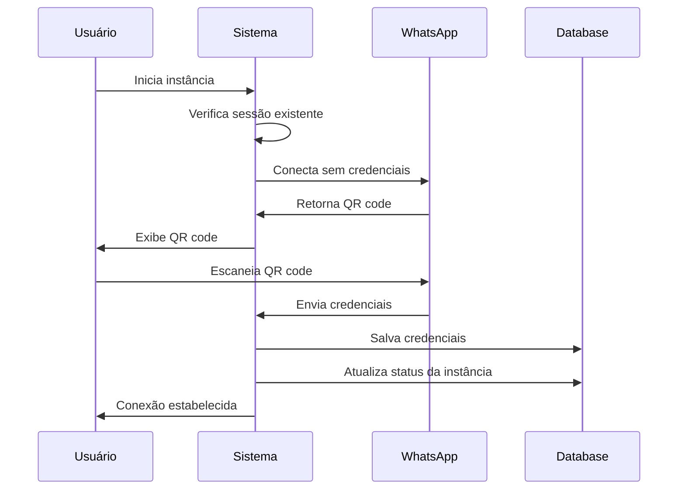
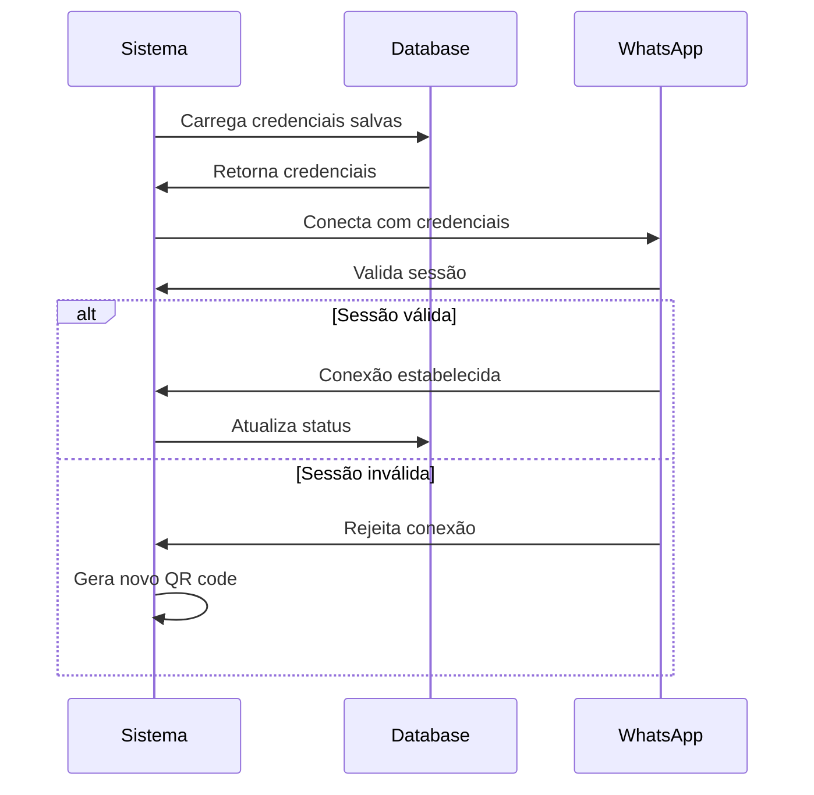

# Guia Completo: Persistência de QR Code e Sessão WhatsApp

## Índice
1. [Visão Geral](#visão-geral)
2. [Fluxo Completo de Autenticação](#fluxo-completo-de-autenticação)
3. [Geração do QR Code](#geração-do-qr-code)
4. [Estados de Autenticação](#estados-de-autenticação)
5. [Tipos de Persistência](#tipos-de-persistência)
6. [Processo de Salvamento](#processo-de-salvamento)
7. [Reconexão Automática](#reconexão-automática)
8. [Configurações Necessárias](#configurações-necessárias)
9. [Estrutura de Dados](#estrutura-de-dados)
10. [Troubleshooting](#troubleshooting)

## Visão Geral

O sistema de persistência do QR code é responsável por manter a sessão do WhatsApp ativa mesmo após reinicializações do servidor. Isso elimina a necessidade de escanear o QR code repetidamente.

### Arquitetura do Sistema

```
┌─────────────────┐    ┌─────────────────┐    ┌─────────────────┐
│   WhatsApp      │    │   Baileys       │    │   Sistema de    │
│   Cliente       │────▶│   Library       │────▶│   Persistência  │
│                 │    │                 │    │                 │
└─────────────────┘    └─────────────────┘    └─────────────────┘
                                                        │
                                                        ▼
                           ┌─────────────────────────────────────────┐
                           │           Opções de Storage             │
                           │  ┌─────────┐  ┌─────────┐  ┌─────────┐ │
                           │  │ Prisma  │  │  Redis  │  │  Files  │ │
                           │  │   DB    │  │  Cache  │  │Provider │ │
                           │  └─────────┘  └─────────┘  └─────────┘ │
                           └─────────────────────────────────────────┘
```

## Fluxo Completo de Autenticação

### 1. Inicialização da Instância

```typescript
// Método principal: connectToWhatsapp()
public async connectToWhatsapp(number?: string): Promise<WASocket> {
  try {
    this.loadChatwoot();
    this.loadSettings();
    this.loadWebhook();
    this.loadProxy();

    return await this.createClient(number);
  } catch (error) {
    this.logger.error(error);
    throw new InternalServerErrorException(error?.toString());
  }
}
```

### 2. Criação do Cliente

```typescript
private async createClient(number?: string): Promise<WASocket> {
  // 1. Define o estado de autenticação
  this.instance.authState = await this.defineAuthState();
  
  // 2. Configura as opções do socket
  const socketConfig: UserFacingSocketConfig = {
    auth: {
      creds: this.instance.authState.state.creds,
      keys: makeCacheableSignalKeyStore(this.instance.authState.state.keys, P({ level: 'error' }) as any),
    },
    // ... outras configurações
  };

  // 3. Cria a conexão
  this.client = makeWASocket(socketConfig);
  
  // 4. Configura os event handlers
  this.eventHandler();
  
  return this.client;
}
```

## Geração do QR Code

### Processo de Geração

O QR code é gerado no método `connectionUpdate()` quando há uma mudança no estado da conexão:

```typescript
private async connectionUpdate({ qr, connection, lastDisconnect }: Partial<ConnectionState>) {
  if (qr) {
    // 1. Verifica limite de tentativas
    if (this.instance.qrcode.count === this.configService.get<QrCode>('QRCODE').LIMIT) {
      // Emite webhook de limite atingido
      this.sendDataWebhook(Events.QRCODE_UPDATED, {
        message: 'QR code limit reached, please login again',
        statusCode: DisconnectReason.badSession,
      });
      
      this.endSession = true;
      return this.eventEmitter.emit('no.connection', this.instance.name);
    }

    // 2. Incrementa contador
    this.instance.qrcode.count++;

    // 3. Define configurações do QR code
    const color = this.configService.get<QrCode>('QRCODE').COLOR;
    const optsQrcode: QRCodeToDataURLOptions = {
      margin: 3,
      scale: 4,
      errorCorrectionLevel: 'H',
      color: { light: '#ffffff', dark: color },
    };

    // 4. Gera código de pareamento (se número fornecido)
    if (this.phoneNumber) {
      await delay(1000);
      this.instance.qrcode.pairingCode = await this.client.requestPairingCode(this.phoneNumber);
    } else {
      this.instance.qrcode.pairingCode = null;
    }

    // 5. Converte QR para base64
    qrcode.toDataURL(qr, optsQrcode, (error, base64) => {
      if (error) {
        this.logger.error('Qrcode generate failed:' + error.toString());
        return;
      }

      // 6. Armazena dados do QR code
      this.instance.qrcode.base64 = base64;
      this.instance.qrcode.code = qr;

      // 7. Emite webhook com QR code
      this.sendDataWebhook(Events.QRCODE_UPDATED, {
        qrcode: { 
          instance: this.instance.name, 
          pairingCode: this.instance.qrcode.pairingCode, 
          code: qr, 
          base64 
        },
      });
    });

    // 8. Atualiza status no banco
    await this.prismaRepository.instance.update({
      where: { id: this.instanceId },
      data: { connectionStatus: 'connecting' },
    });
  }
}
```

### Estrutura do QR Code

```typescript
interface QrCode {
  pairingCode?: string;  // Código de pareamento (alternativa ao QR)
  code?: string;         // Código QR bruto
  base64?: string;       // QR code em formato base64 para exibição
  count: number;         // Contador de tentativas
}
```

## Estados de Autenticação

### Definição do Estado de Autenticação

```typescript
private async defineAuthState() {
  const db = this.configService.get<Database>('DATABASE');
  const cache = this.configService.get<CacheConf>('CACHE');
  const provider = this.configService.get<ProviderSession>('PROVIDER');

  // Prioridade 1: Provider personalizado
  if (provider?.ENABLED) {
    this.logger.info('Using custom provider for auth state');
    return await this.authStateProvider.authStateProvider(this.instance.id);
  }

  // Prioridade 2: Redis Cache
  if (cache?.REDIS.ENABLED && cache?.REDIS.SAVE_INSTANCES) {
    this.logger.info('Redis enabled for auth state');
    return await useMultiFileAuthStateRedisDb(this.instance.id, this.cache);
  }

  // Prioridade 3: Banco de dados
  if (db.SAVE_DATA.INSTANCE) {
    this.logger.info('Using database for auth state');
    return await useMultiFileAuthStatePrisma(this.instance.id, this.cache);
  }
}
```

### Componentes do Auth State

```typescript
interface AuthState {
  state: {
    creds: AuthenticationCreds;    // Credenciais de autenticação
    keys: SignalKeyStore;          // Chaves de criptografia Signal
  };
  saveCreds: () => Promise<void>;  // Função para salvar credenciais
}
```

## Tipos de Persistência

### 1. Provider de Arquivos

**Localização**: `@utils/use-multi-file-auth-state-provider-files`

```typescript
export class AuthStateProvider {
  constructor(private readonly providerFiles: ProviderFiles) {}

  async authStateProvider(instanceId: string) {
    // Utiliza sistema de arquivos para persistir
    // Cada instância tem sua pasta separada
    // Credenciais são salvas em arquivos JSON
    return await this.providerFiles.load(instanceId);
  }
}
```

**Estrutura de Arquivos**:
```
/sessions/
├── instance_1/
│   ├── creds.json
│   ├── keys/
│   │   ├── sender-key.json
│   │   ├── session.json
│   │   └── ...
└── instance_2/
    ├── creds.json
    └── keys/
```

### 2. Redis Cache

**Localização**: `@utils/use-multi-file-auth-state-redis-db`

```typescript
async function useMultiFileAuthStateRedisDb(instanceId: string, cache: CacheService) {
  // Utiliza Redis para cache distribuído
  // Ideal para múltiplas instâncias de servidor
  // Dados são serializados e armazenados com TTL
  
  const readKey = async (id: string) => {
    const data = await cache.get(`auth:${instanceId}:${id}`);
    return data ? JSON.parse(data) : null;
  };

  const writeKey = async (id: string, data: any) => {
    await cache.set(`auth:${instanceId}:${id}`, JSON.stringify(data));
  };

  return { readKey, writeKey };
}
```

**Vantagens do Redis**:
- Alta performance
- Compartilhamento entre instâncias
- Persistence opcional
- Expiração automática

### 3. Banco de Dados (Prisma)

**Localização**: `@utils/use-multi-file-auth-state-prisma`

```typescript
async function useMultiFileAuthStatePrisma(instanceId: string, cache: CacheService) {
  // Utiliza banco de dados relacional
  // Dados são persistidos permanentemente
  // Suporte a transações e backup
  
  return {
    state: {
      creds: await loadCredsFromDatabase(instanceId),
      keys: makeCacheableSignalKeyStore(await loadKeysFromDatabase(instanceId))
    },
    saveCreds: async () => {
      await saveCredsToDatabase(instanceId, creds);
    }
  };
}
```

**Tabelas Utilizadas**:
```sql
-- Tabela de sessões
CREATE TABLE sessions (
  sessionId VARCHAR PRIMARY KEY,
  creds JSONB,
  createdAt TIMESTAMP,
  updatedAt TIMESTAMP
);

-- Tabela de chaves
CREATE TABLE session_keys (
  sessionId VARCHAR,
  keyId VARCHAR,
  keyData JSONB,
  PRIMARY KEY (sessionId, keyId)
);
```

## Processo de Salvamento

### 1. Detecção de Mudanças

O sistema monitora eventos do Baileys para detectar mudanças:

```typescript
private eventHandler() {
  this.client.ev.process(async (events) => {
    // Salva credenciais quando há mudanças
    if (events['creds.update']) {
      this.instance.authState.saveCreds();
    }

    // Atualiza estado de conexão
    if (events['connection.update']) {
      this.connectionUpdate(events['connection.update']);
    }

    // ... outros eventos
  });
}
```

### 2. Salvamento de Credenciais

```typescript
// Exemplo de implementação saveCreds
const saveCreds = async () => {
  try {
    // 1. Serializa credenciais
    const credsData = JSON.stringify(creds, BufferJSON.replacer);
    
    // 2. Salva no storage escolhido
    switch (storageType) {
      case 'redis':
        await redis.set(`creds:${instanceId}`, credsData);
        break;
      case 'database':
        await prisma.session.upsert({
          where: { sessionId: instanceId },
          create: { sessionId: instanceId, creds: credsData },
          update: { creds: credsData, updatedAt: new Date() }
        });
        break;
      case 'files':
        await fs.writeFile(`./sessions/${instanceId}/creds.json`, credsData);
        break;
    }
    
    this.logger.info(`Credentials saved for instance: ${instanceId}`);
  } catch (error) {
    this.logger.error(`Error saving credentials: ${error.message}`);
  }
};
```

### 3. Atualização da Instância

Quando a conexão é estabelecida:

```typescript
if (connection === 'open') {
  // 1. Extrai WUID (WhatsApp User ID)
  this.instance.wuid = this.client.user.id.replace(/:\d+/, '');
  
  // 2. Busca foto do perfil
  try {
    const profilePic = await this.profilePicture(this.instance.wuid);
    this.instance.profilePictureUrl = profilePic.profilePictureUrl;
  } catch (error) {
    this.instance.profilePictureUrl = null;
  }
  
  // 3. Atualiza dados no banco
  await this.prismaRepository.instance.update({
    where: { id: this.instanceId },
    data: {
      ownerJid: this.instance.wuid,
      profileName: (await this.getProfileName()) as string,
      profilePicUrl: this.instance.profilePictureUrl,
      connectionStatus: 'open',
    },
  });

  // 4. Emite webhooks de confirmação
  this.sendDataWebhook(Events.CONNECTION_UPDATE, {
    instance: this.instance.name,
    wuid: this.instance.wuid,
    profileName: await this.getProfileName(),
    profilePictureUrl: this.instance.profilePictureUrl,
    ...this.stateConnection,
  });
}
```

## Reconexão Automática

### Detecção de Desconexão

```typescript
if (connection === 'close') {
  const statusCode = (lastDisconnect?.error as Boom)?.output?.statusCode;
  
  // Códigos que não devem reconectar
  const codesToNotReconnect = [
    DisconnectReason.loggedOut,    // 401 - Usuário foi deslogado
    DisconnectReason.forbidden,    // 403 - Acesso negado
    402,                           // Payment required
    406                            // Not acceptable
  ];
  
  const shouldReconnect = !codesToNotReconnect.includes(statusCode);
  
  if (shouldReconnect) {
    // Reconecta automaticamente
    await this.connectToWhatsapp(this.phoneNumber);
  } else {
    // Marca instância como fechada
    await this.prismaRepository.instance.update({
      where: { id: this.instanceId },
      data: {
        connectionStatus: 'close',
        disconnectionAt: new Date(),
        disconnectionReasonCode: statusCode,
        disconnectionObject: JSON.stringify(lastDisconnect),
      },
    });
    
    // Encerra sessão
    this.eventEmitter.emit('logout.instance', this.instance.name, 'inner');
    this.client?.ws?.close();
    this.client.end(new Error('Close connection'));
  }
}
```

### Carregamento de Sessão Existente

```typescript
// Ao inicializar, o sistema verifica se já existe uma sessão
const existingSession = await this.prismaRepository.session.findFirst({
  where: { sessionId: this.instanceId }
});

if (existingSession) {
  // 1. Carrega credenciais salvas
  const creds = JSON.parse(JSON.stringify(existingSession.creds), BufferJSON.reviver);
  
  // 2. Reconstrói estado de autenticação
  this.instance.authState = {
    state: { creds, keys: await loadKeysFromStorage(this.instanceId) },
    saveCreds: async () => await this.saveCredentials()
  };
  
  // 3. Tenta reconectar automaticamente
  await this.connectToWhatsapp();
}
```

## Configurações Necessárias

### 1. Configuração do Banco de Dados

```typescript
// config/env.config.ts
export interface Database {
  SAVE_DATA: {
    INSTANCE: boolean;      // Salvar dados da instância
    NEW_MESSAGE: boolean;   // Salvar mensagens novas
    MESSAGE_UPDATE: boolean;// Salvar atualizações de mensagens
    CONTACTS: boolean;      // Salvar contatos
    CHATS: boolean;         // Salvar chats
    LABELS: boolean;        // Salvar labels
    HISTORIC: boolean;      // Salvar histórico
  };
  DELETE_DATA: {
    LOGICAL_MESSAGE_DELETE: boolean; // Exclusão lógica de mensagens
  };
}
```

### 2. Configuração do Cache

```typescript
export interface CacheConf {
  REDIS: {
    ENABLED: boolean;
    URI: string;
    PREFIX_KEY: string;
    SAVE_INSTANCES: boolean;
  };
  LOCAL: {
    ENABLED: boolean;
    TTL: number;
  };
}
```

### 3. Configuração do QR Code

```typescript
export interface QrCode {
  LIMIT: number;    // Limite de tentativas (padrão: 5)
  COLOR: string;    // Cor do QR code (padrão: '#000000')
}
```

### 4. Configuração do Provider

```typescript
export interface ProviderSession {
  ENABLED: boolean;
  HOST: string;
  PORT: number;
  PREFIX: string;
}
```

## Estrutura de Dados

### 1. Tabela de Instâncias

```sql
CREATE TABLE instances (
  id VARCHAR PRIMARY KEY,
  name VARCHAR NOT NULL,
  ownerJid VARCHAR,
  profileName VARCHAR,
  profilePicUrl TEXT,
  connectionStatus VARCHAR DEFAULT 'close',
  disconnectionAt TIMESTAMP,
  disconnectionReasonCode INTEGER,
  disconnectionObject JSONB,
  createdAt TIMESTAMP DEFAULT NOW(),
  updatedAt TIMESTAMP DEFAULT NOW()
);
```

### 2. Tabela de Sessões

```sql
CREATE TABLE sessions (
  sessionId VARCHAR PRIMARY KEY,
  creds JSONB NOT NULL,
  createdAt TIMESTAMP DEFAULT NOW(),
  updatedAt TIMESTAMP DEFAULT NOW()
);
```

### 3. Estrutura das Credenciais

```typescript
interface AuthenticationCreds {
  noiseKey: {
    private: Uint8Array;
    public: Uint8Array;
  };
  pairingEphemeralKeyPair: {
    private: Uint8Array;
    public: Uint8Array;
  };
  signedIdentityKey: {
    private: Uint8Array;
    public: Uint8Array;
  };
  signedPreKey: {
    keyPair: {
      private: Uint8Array;
      public: Uint8Array;
    };
    signature: Uint8Array;
    keyId: number;
  };
  registrationId: number;
  advSecretKey: string;
  processedHistoryMessages: [];
  nextPreKeyId: number;
  firstUnuploadedPreKeyId: number;
  accountSyncCounter: number;
  accountSettings: AccountSettings;
  deviceId: string;
  phoneId: string;
  identityId: Buffer;
  registered: boolean;
  backupToken: Buffer;
  registration: any;
  me?: Contact;
  account?: any;
  signalIdentities: any[];
  myAppStateKeyId?: string;
  platform?: string;
}
```

## Fluxo de Vida Completo

### 1. Primeira Conexão (QR Code)



### 2. Reconexão Automática



## Troubleshooting

### Problemas Comuns

#### 1. Sessão Perdida

**Sintomas**: Sistema sempre solicita novo QR code

**Possíveis Causas**:
- Configuração de persistência incorreta
- Problemas de permissão de escrita
- Redis desconectado
- Banco de dados inacessível

**Soluções**:
```typescript
// Verificar configuração
const db = this.configService.get<Database>('DATABASE');
console.log('Database config:', db.SAVE_DATA.INSTANCE);

// Verificar conexão Redis
const cache = this.configService.get<CacheConf>('CACHE');
if (cache.REDIS.ENABLED) {
  await this.cache.ping(); // Deve retornar 'PONG'
}

// Verificar dados salvos
const session = await this.prismaRepository.session.findFirst({
  where: { sessionId: instanceId }
});
console.log('Existing session:', session ? 'Found' : 'Not found');
```

#### 2. Erro de Desserialização

**Sintomas**: Erro ao carregar credenciais

**Solução**:
```typescript
try {
  const creds = JSON.parse(JSON.stringify(data.creds), BufferJSON.reviver);
} catch (error) {
  this.logger.error('Failed to deserialize credentials:', error);
  // Limpar sessão corrompida
  await this.prismaRepository.session.delete({
    where: { sessionId: instanceId }
  });
}
```

#### 3. Múltiplas Instâncias

**Sintomas**: Conflitos entre instâncias

**Solução**:
```typescript
// Usar locks para evitar conflitos
const lockKey = `lock:${instanceId}`;
const lock = await this.cache.set(lockKey, 'locked', 'PX', 30000, 'NX');

if (!lock) {
  throw new Error('Instance already running');
}

try {
  await this.connectToWhatsapp();
} finally {
  await this.cache.del(lockKey);
}
```

### Logs de Debug

```typescript
// Ativar logs detalhados
this.logger.info(`Instance ${instanceId} - Auth state type: ${authStateType}`);
this.logger.info(`Instance ${instanceId} - Connection status: ${connection}`);
this.logger.info(`Instance ${instanceId} - Credentials saved: ${credsTimestamp}`);

// Monitorar eventos
this.client.ev.on('creds.update', () => {
  this.logger.debug(`Instance ${instanceId} - Credentials updated`);
});
```

### Backup e Recuperação

```typescript
// Backup das credenciais
const backupSession = async (instanceId: string) => {
  const session = await this.prismaRepository.session.findFirst({
    where: { sessionId: instanceId }
  });
  
  if (session) {
    const backup = {
      sessionId: session.sessionId,
      creds: session.creds,
      timestamp: new Date().toISOString()
    };
    
    await fs.writeFile(
      `./backups/session_${instanceId}_${Date.now()}.json`,
      JSON.stringify(backup, null, 2)
    );
  }
};

// Restaurar sessão
const restoreSession = async (instanceId: string, backupFile: string) => {
  const backup = JSON.parse(await fs.readFile(backupFile, 'utf8'));
  
  await this.prismaRepository.session.upsert({
    where: { sessionId: instanceId },
    create: {
      sessionId: instanceId,
      creds: backup.creds
    },
    update: {
      creds: backup.creds
    }
  });
};
```

## Conclusão

O sistema de persistência do QR code é uma arquitetura robusta que permite:

1. **Múltiplas opções de storage** (Files, Redis, Database)
2. **Reconexão automática** sem necessidade de novo QR code
3. **Backup e recuperação** de sessões
4. **Monitoramento em tempo real** do status da conexão
5. **Tratamento de erros** e situações de falha

A implementação utiliza o padrão **Strategy** para escolher o tipo de persistência, garantindo flexibilidade e escalabilidade do sistema. 